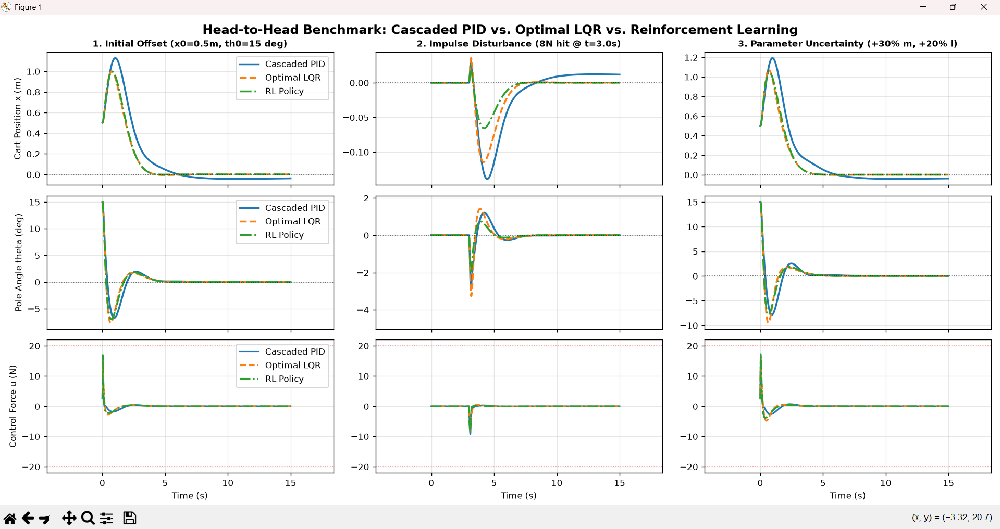

# Inverted Pendulum (Cart-Pole): PID vs LQR vs Reinforcement Learning

Modelling, simulation and head-to-head benchmarking of three balancing controllers on the same nonlinear cart-pole plant:

| Controller | Idea | File |
|---|---|---|
| **Cascaded PID** | Slow position loop sets a lean-angle reference; fast angle loop produces the cart force | `PID-controller.py` |
| **LQR** | Discrete-time optimal full-state feedback from the linearised model (DARE) | `LQR-controller.py` |
| **RL policy** | Neural policy trained by gradient descent through a differentiable, randomised simulator | `RL-controller.py` |
| **Unified benchmark** | Runs all three on identical plants, states and disturbances; produces the comparison table and figure | `Merge-all.py` |



---

## Contents

1. [Repository layout](#repository-layout)
2. [Quick start](#quick-start)
3. [Plant and mathematical model](#plant-and-mathematical-model)
4. [Controllers](#controllers)
5. [Benchmark protocol](#benchmark-protocol)
6. [Results](#results)
7. [Reproducibility](#reproducibility)
8. [Limitations](#limitations)

---

## Repository layout

```
.
├── PID-controller.py      # plant + cascaded PID + metrics + 3-scenario dashboard
├── LQR-controller.py      # plant + discrete LQR (DARE) + metrics + dashboard
├── RL-controller.py       # plant + batched torch simulator + policy + training + eval
├── Merge-all.py           # imports the three controllers, runs the unified benchmark
├── rl_policy.pt           # trained RL policy weights (state_dict)
├── requirements.txt
├── PID-result.png         # PID dashboard
├── LQR-result.png         # LQR dashboard
├── RL-result.png          # RL dashboard
└── Compared-results.png   # 3-way overlay produced by Merge-all.py
```

Each controller file is self-contained (it carries its own copy of the plant and the metrics code) and can be run on its own. `Merge-all.py` imports the three files by name with `importlib`, so run it from the repository root.

---

## Quick start

```bash
pip install -r requirements.txt

# Individual controllers (each prints a metrics summary and shows a 3x3 dashboard)
python PID-controller.py
python LQR-controller.py
python RL-controller.py --load rl_policy.pt        # use the shipped policy

# Unified head-to-head benchmark (loads rl_policy.pt, saves the overlay figure)
python Merge-all.py
```

RL training options:

```bash
python RL-controller.py                 # full training (~14 min on CPU), saves rl_policy.pt
python RL-controller.py --quick         # short smoke-test run
python RL-controller.py --save my.pt    # choose output path
python RL-controller.py --device cuda   # defaults to CUDA if available, else CPU
python RL-controller.py --no-plot       # print metrics only
```

`Merge-all.py` writes `PID_vs_LQR_vs_RL_Overlay.png`. If `rl_policy.pt` is missing it falls back to training the policy.

---

## Plant and mathematical model

State $s = [x,\ \dot x,\ \theta,\ \dot\theta]$, with $\theta = 0$ the upright equilibrium. Input $u$ is a horizontal force on the cart.

| Symbol | Meaning | Value |
|---|---|---|
| $M$ | cart mass | 1.0 kg |
| $m$ | pole mass | 0.2 kg |
| $l$ | pivot to pole centre of mass (pole length $2l$ = 1.0 m) | 0.5 m |
| $b_c$ | cart viscous friction | 0.1 N·s/m |
| $b_p$ | pivot damping | 0.005 N·m·s/rad |
| $g$ | gravity | 9.81 m/s² |
| $I$ | pole inertia about its COM, $\tfrac13 m l^2$ | 0.0167 kg·m² |
| $u_{max}$ | actuator saturation | 20 N |
| $\dot u_{max}$ | actuator slew-rate limit | 500 N/s |

**Nonlinear equations of motion** (with $I_t = I + m l^2$):

$$
D = (M+m)\,I_t - (m l \cos\theta)^2
$$

$$
\ddot x = \frac{I_t\,(u - b_c\dot x + m l \dot\theta^2 \sin\theta) - m l\cos\theta\,(m g l \sin\theta - b_p\dot\theta)}{D}
$$

$$
\ddot\theta = \frac{(M+m)\,(m g l \sin\theta - b_p\dot\theta) - m l\cos\theta\,(u - b_c\dot x + m l \dot\theta^2 \sin\theta)}{D}
$$

**Linearisation** about $s = 0$ (used by LQR), with $D_0 = (M+m)I_t - (ml)^2$:

$$
A=\begin{bmatrix}0&1&0&0\\[2pt]0&-\frac{I_t b_c}{D_0}&-\frac{m^2l^2g}{D_0}&\frac{m l b_p}{D_0}\\[2pt]0&0&0&1\\[2pt]0&\frac{m l b_c}{D_0}&\frac{(M+m)\,m g l}{D_0}&-\frac{(M+m)\,b_p}{D_0}\end{bmatrix},\qquad
B=\begin{bmatrix}0\\ \frac{I_t}{D_0}\\ 0\\ -\frac{m l}{D_0}\end{bmatrix}
$$

The pair $(A,B)$ has controllability rank 4/4 (checked in code).

**Simulation environment** (identical in all four scripts):

- Integrator: RK4, plant step 5 ms.
- Actuator: command passes a slew-rate limiter (500 N/s) and then a saturation (±20 N) before it reaches the plant. External disturbance force is added after the actuator.
- Pole angle is wrapped to $[-\pi, \pi]$.

---

## Controllers

### 1. Cascaded PID (`PID-controller.py`)

A single PID cannot regulate both pole angle and cart position with one actuator, so two loops are cascaded:

- **Outer loop (slow):** cart position error and cart velocity are mapped to a *lean-angle reference*. If the cart is right of the reference, the pole is asked to lean left, so the cart has to drive back to catch it. The reference is clamped to ±8° and low-pass filtered ($\tau_r = 0.15$ s) so the inner loop does not chatter.
- **Inner loop (fast):** a PID on pole angle error produces the cart force. The derivative acts on the *measurement* (no derivative kick when the reference moves) and is low-pass filtered.
- Both integrators use conditional anti-windup and clamps. The inner integral is set to zero because it fought the phase lag.

| Loop | $K_p$ | $K_i$ | $K_d$ | Filter |
|---|---|---|---|---|
| Inner (angle → force) | 68.0 | 0.0 | 14.5 | $\tau_a = 0.015$ s |
| Outer (position → angle) | 0.04 | 0.002 | 0.10 | $\tau_x = 0.10$ s |

Gains are fixed (no gain scheduling or online adaptation).

<!-- TODO(author): state how these gains were found (manual loop-by-loop tuning, sweep, etc.) -->

### 2. LQR (`LQR-controller.py`)

1. Linearise the nominal plant about the upright equilibrium and check controllability.
2. Discretise $(A,B)$ at the control period (zero-order hold, 4th-order Taylor series for the matrix exponential).
3. Solve the **discrete algebraic Riccati equation** (`scipy.linalg.solve_discrete_are`) with $Q\,dt$ and $R\,dt$.
4. Apply $u = -K\,(s - s_{ref})$, saturated at ±20 N.

Weights: $Q = \mathrm{diag}(20,\ 8,\ 300,\ 30)$, $R = 1.0$. The angle is weighted most heavily because balancing is the primary objective; the other weights were chosen so the initial command for the 0.5 m / 15° start stays below the 20 N limit.

Resulting gain and poles (nominal plant):

```
K = [-4.308, -7.0326, -58.0328, -14.91]
closed-loop eigenvalues: -9.132, -3.22, -1.215 ± 0.759j
```

### 3. RL policy (`RL-controller.py`)

The policy is trained by **backpropagating the cost through a differentiable, batched simulator** (policy optimisation by gradient descent through time on rollouts), not by model-free PPO/SAC. The simulator is a PyTorch re-implementation of the same plant, so thousands of randomised rollouts run in parallel.

**Policy.** $u = u_{max}\tanh\!\big(W_{lin}\,\hat s + \mathrm{MLP}(\hat s)\big)$ where $\hat s$ is the scaled state. The MLP is 4→64→64→1 with tanh activations. All layers are bias-free, so the policy is odd-symmetric and $\pi(0)=0$ (the equilibrium is preserved). The linear skip path is initialised with a sign-correct prior (push towards the lean), not an LQR solution.

**Training matches deployment.**

- The 500 N/s slew limit and 20 N saturation are simulated inside the rollout, with a straight-through gradient so learning does not stall when the limiter is active.
- Control period is 10 ms (two 5 ms RK4 sub-steps, zero-order hold), and the deployed controller holds each action for two plant steps.
- Fast NumPy inference at evaluation time.

**Curriculum (3 stages).**

| Stage | Epochs | Horizon | LR | Randomisation |
|---|---|---|---|---|
| 1 Angle catch | 100 | 0.8 s | 4e-3 | none, low position weight |
| 2 Position recovery | 150 | 2.5 s | 3e-3 | none |
| 3 Robustness | 250 | 6.0 s | 2e-3 | domain randomisation + random disturbances |

- **Stage 3 randomisation:** $M \in [0.80, 1.25]\times$, $m \in [0.75, 1.35]\times$, $l \in [0.80, 1.25]\times$, $b_c, b_p \in [0.6, 1.4]\times$ nominal. 30 % of samples receive a random ±12 N, 0.1 s pulse at a random time.
- **Cost:** quadratic state cost $(q_x, q_{\dot x}, q_\theta, q_{\dot\theta}) = (22, 9, 300, 32)$ plus control and control-rate penalties, a heavy penalty beyond 40° of tilt, and a terminal cost.
- **Optimiser:** AdamW with cosine LR decay, batch 256, gradient clipping at 5.
- **Model selection:** a fixed 10 s, domain-randomised validation set (128 rollouts) is evaluated every 10 epochs in stage 3, and the best checkpoint is restored (validation cost 52.51).
- **Seed:** 42.

Training log (CPU): stage 1 finished at 35.8 s, stage 2 at 192 s, stage 3 at 854 s. Local linear gains of the trained policy at the origin: $\partial u/\partial s = [7.91,\ 12.76,\ 93.49,\ 27.69]$ (all positive on angle and rate, as expected for a stabilising law).

---

## Benchmark protocol

All three controllers face the same plant model, actuator limits, integrator and metric code. `Merge-all.py` runs the following with a 5 ms step and a 15 s horizon.

| # | Scenario | Plant | Initial state | Disturbance |
|---|---|---|---|---|
| 1 | Initial offset | nominal | $x_0 = 0.5$ m, $\theta_0 = 15°$ | none |
| 2 | Impulse disturbance | nominal | upright, at rest | 8 N pulse, 0.1 s, at $t = 3$ s |
| 3 | Parameter uncertainty | perturbed: $M{+}10\%$, $m{+}30\%$, $l{+}20\%$, $b_c{-}30\%$, $b_p{-}40\%$ | $x_0 = 0.5$ m, $\theta_0 = 15°$ | none |

Controllers are designed or trained on the **nominal** plant only; scenario 3 tests robustness to model error without retuning.

**Metrics** (identical code in every file):

| Metric | Definition |
|---|---|
| Stabilised | $\max\lvert\theta\rvert < 45°$ and final $\lvert\theta\rvert < 1°$ |
| Settling time [1°, 5 cm] | last time $\lvert\theta\rvert \ge 1°$ or $\lvert x - x_{ref}\rvert \ge 5$ cm |
| Settling time [0.5°, 2 cm] | same with a stricter band; equals the horizon if it never settles |
| Rise time | time for $\lvert\theta\rvert$ to fall from 90 % to 10 % of $\lvert\theta_0\rvert$ (reported as 0 when $\theta_0 \approx 0$) |
| Overshoot (%) | largest opposite-sign excursion after the start, as % of $\lvert\theta_0\rvert$. When $\theta_0 \approx 0$ (scenario 2) the reported number is instead the **peak angle in degrees** |
| SS error $\lvert x\rvert$, $\lvert\theta\rvert$ | mean over the last 1 s |
| Control energy | $\int u^2\,dt$ using the force actually applied (after slew/saturation) |
| Peak $\lvert u\rvert$ | maximum applied force |

---

## Results

Standalone runs of each script (the closed-loop traces are in `PID-result.png`, `LQR-result.png`, `RL-result.png`, and the overlay is `Compared-results.png`).

### Scenario 1: initial offset ($x_0 = 0.5$ m, $\theta_0 = 15°$)

| Controller | Settling [1°, 5 cm] (s) | Settling [0.5°, 2 cm] (s) | Rise (s) | Overshoot (%) | SS \|x\| (m) | Energy ∫u² | Peak \|u\| (N) |
|---|---:|---:|---:|---:|---:|---:|---:|
| Cascaded PID | 4.95 | 15.0 (not settled) | 0.280 | 44.9 | 0.0391 | 14.24 | 16.8 |
| LQR | 3.36 | 3.95 | 0.200 | 51.0 | 0.0 | 17.19 | 15.5 |
| RL | 3.42 | 3.95 | 0.195 | 46.7 | 0.0 | 18.46 | 16.9 |

### Scenario 3: perturbed plant

| Controller | Settling [1°, 5 cm] (s) | Settling [0.5°, 2 cm] (s) | Rise (s) | Overshoot (%) | SS \|x\| (m) | Energy ∫u² | Peak \|u\| (N) |
|---|---:|---:|---:|---:|---:|---:|---:|
| Cascaded PID | 5.03 | 15.0 (not settled) | 0.275 | 52.5 | 0.0393 | 20.27 | 17.2 |
| LQR | 3.41 | 3.89 | 0.195 | 63.3 | 0.0 | 28.09 | 16.4 |
| RL | 3.41 | 3.89 | 0.185 | 52.8 | 0.0 | 28.88 | 17.4 |

### Scenario 2: impulse disturbance

| Controller | Applied pulse | Settling [1°, 5 cm] (s) | Settling [0.5°, 2 cm] (s) | Peak angle (°) | SS \|x\| (m) | Energy ∫u² | Peak \|u\| (N) |
|---|---|---:|---:|---:|---:|---:|---:|
| Cascaded PID | 8 N | 5.89 | 6.68 | 2.79 | 0.0118 | 7.02 | 9.29 |
| LQR | 8 N | 5.40 | 6.09 | 3.26 | 0.0 | 5.86 | 7.89 |

<!-- TODO(author): the standalone RL run used a 12 N pulse (BENCH_DIST_FORCE in RL-controller.py), so it is not comparable to the 8 N rows above.
     Run `python Merge-all.py`, paste its scenario-2 table here, and delete the note. -->

### Observations

- **LQR and RL are close** on angle recovery and settling in scenarios 1 and 3. RL has a slightly shorter rise time and, in scenario 3, less overshoot than LQR (52.8 % vs 63.3 %). LQR uses less control energy in scenario 1.
- **PID** balances in every scenario with the lowest control energy and force in the offset cases, but its slow outer loop leaves a residual cart offset of about 4 cm after 15 s, so it never enters the strict 2 cm band.
- **Robustness:** all three stay stabilised on the perturbed plant without retuning.

---

## Reproducibility

- Pure Python/NumPy/PyTorch; no external simulator is needed.
- Fixed seeds: NumPy and PyTorch seed 42; the RL validation set uses its own fixed seed (1234).
- The trained policy `rl_policy.pt` is included, so the benchmark runs without retraining.
- Install exact dependencies from `requirements.txt`.

---

## Limitations

- **Simulator:** a custom RK4 implementation of the cart-pole equations, not a ROS 2 / Gazebo physics pipeline.
- **RL method:** the policy uses gradients through the known simulator dynamics, so it relies on a differentiable model of the plant. It is not a model-free method trained from interaction alone.
- **Single plant and test set:** one nominal plant, three scenarios, and one perturbed plant. There is no Monte-Carlo parameter sweep or sensor-noise study.
- **No sensing model:** controllers receive the exact full state with no noise or delay.
- **Rise time / overshoot** are regulation-style definitions (decay from the initial tilt), not step-response definitions.
